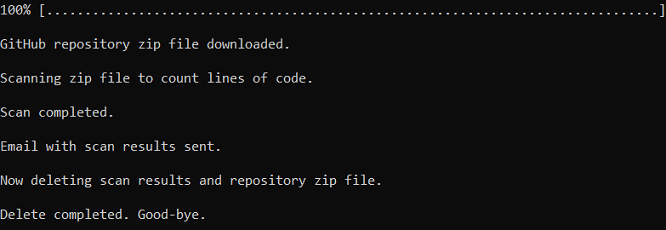
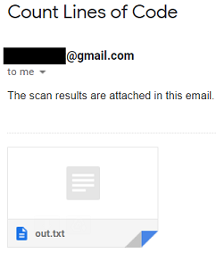
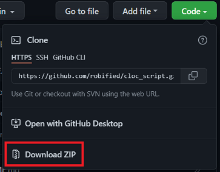

# Count Lines of Code Script

## Introduction

- The purpose of this Python script is to be able to scan a GitHub repository with CLOC, and email the scan results as an attachment to any recipient.

## How to use the Python script

- `$ python3 cloc_script.py <GitHub repo Download ZIP file link> <recipient’s email address>`

## Screenshots

- Terminal
  - 
- Email
  - 

## Requirements to run the cloc_script.py file

- Operating System

  - Windows Subsystem for Linux (WSL) 2 with Ubuntu 20.04.3 LTS (Focal Fossa)
    - Update and upgrade the Ubuntu system
    - `$ sudo apt update && sudo apt upgrade`

- Debian packages needed
  - To unzip a file
    - https://packages.debian.org/source/stretch/unzip
    - `$ sudo apt install unzip`
  - To count lines of code
    - https://github.com/AlDanial/cloc
    - `$ sudo apt install cloc`
- Python 3.8.10
- Python package needed
  - To download a file
    - https://pypi.org/project/wget/
    - `$ pip3 install wget`
- Create a Gmail account
  - Turn on 2-Step-Verification
    - https://www.google.com/landing/2step/
  - Generate an App password
    - https://myaccount.google.com/u/2/apppasswords
- Create Environment Variables for the Gmail user and App password
  - EMAIL_USER
  - PASSWORD
- A GitHub repository Download ZIP file link
  - 
- A recipient’s email address

## Pseudocode

- Retrieve first command line argument
- Download a github repo zip file
- Create an output file
  - Scan the repo with CLOC
  - Store results to the output file
- Create environment variables
  - Retrieve second command line argument
- Send an email with results attached
- Delete the repo and output file

## Stretch Goal

- To be able to Dockerize all the requirements
